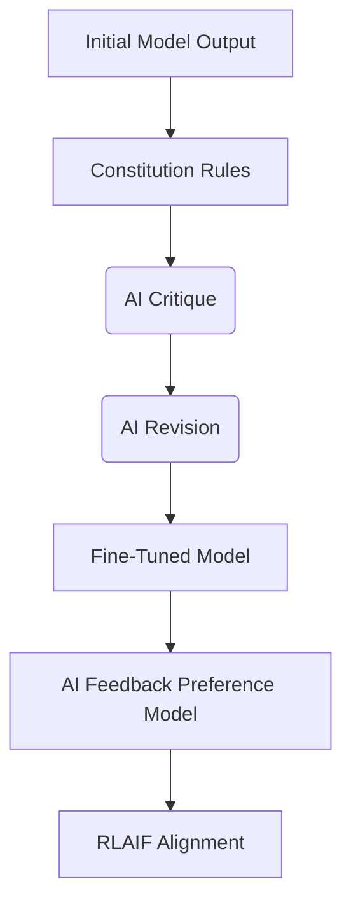

# Constitutional AI (RLAIF)

Constitutional AI replaces human feedback with AI feedback guided by a set of written principles (a "constitution").

## How it Works
1. **Critique and Revision**: The model critiques and revises its own responses using a constitution.
2. **Supervised Learning**: The model is fine-tuned on the revised responses.
3. **AI Feedback (RLAIF)**: An AI evaluator labels model outputs based on the constitution, training a preference model used for reinforcement learning.

## System Diagram

## Compute Tax
Massive upstream inference overhead. Billions of forward-pass tokens are spent running critiques prior to actual model optimization.

[Back to README](../README.md)
