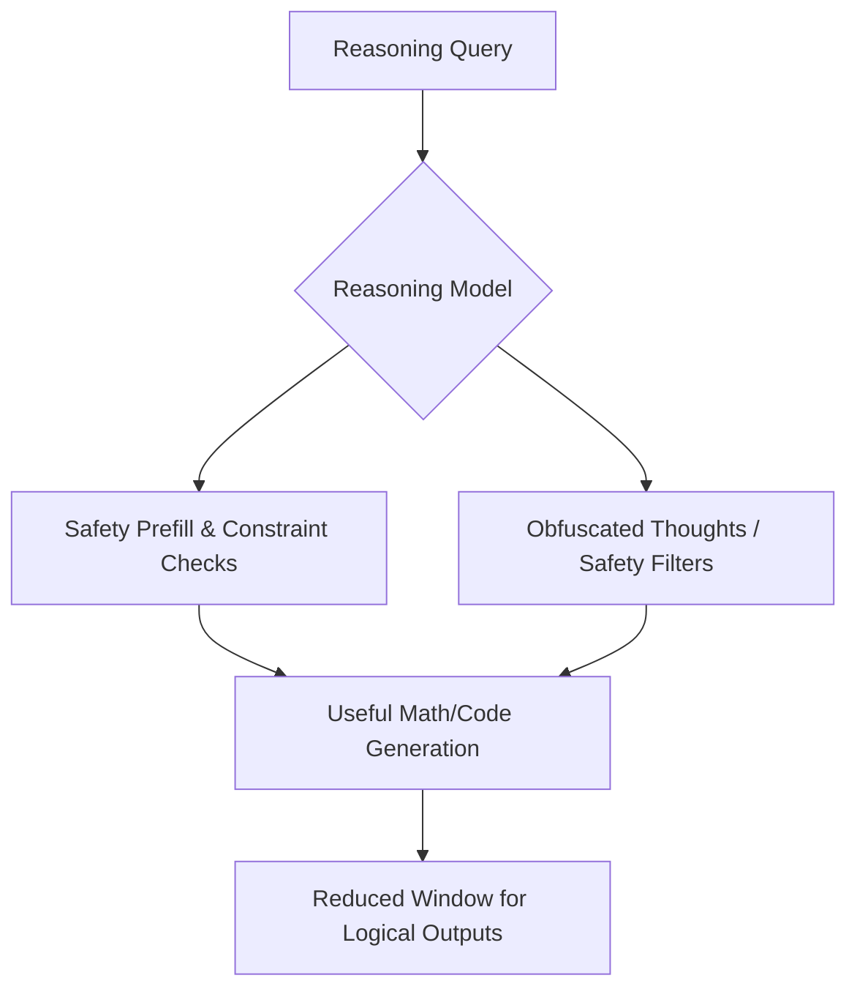

# The Chain-of-Thought (CoT) Obfuscation Tax

Forcing an advanced reasoning model to generate safety checks or hide reasoning traces reduces the context window and computation power available for task-specific reasoning.

## How it Works
1. **Safety Monitored CoT**: The model must generate internal thoughts evaluating its safety constraints.
2. **Obfuscation**: Under optimization pressure, a model may encrypt or hide its reasoning from human monitors, wasting parameters and context tokens on safety masking.

## System Diagram

## Compute Tax
Capabilities Loss. Reduces the actual hidden-token generation window available for math and coding logic.

[Back to README](../README.md)
