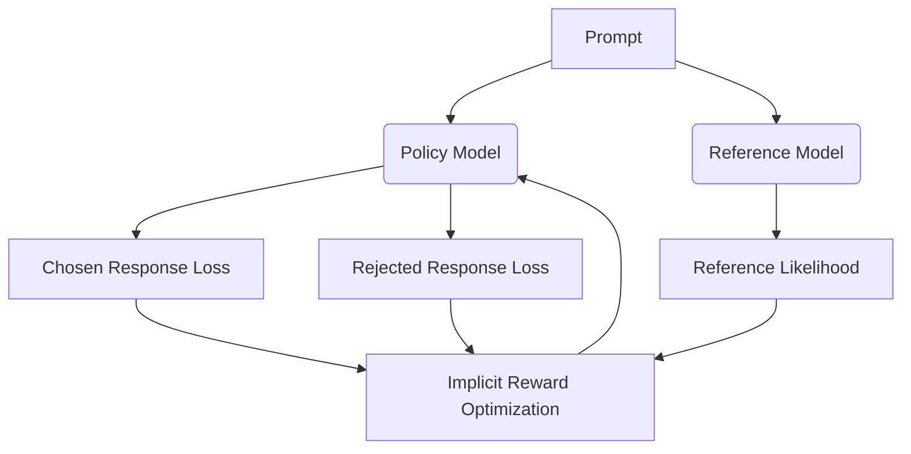

# Direct Preference Optimization (DPO)

Direct Preference Optimization (DPO) bypasses the need for training a separate reward model or using reinforcement learning, optimizing the policy model directly on pairwise preference data.

## How it Works
1. **Mathematical Reparameterization**: DPO shows that the reward function can be implicitly expressed as a function of the policy and reference models.
2. **Direct Optimization**: The policy is fine-tuned directly on pairs of chosen and rejected responses using a simple binary cross-entropy loss.

## System Diagram

## Compute Tax
DPO requires maintaining an active Reference Model alongside the Target Model to compute a KL-divergence penalty. This effectively doubles the baseline training memory footprint.

[Back to README](../README.md)
