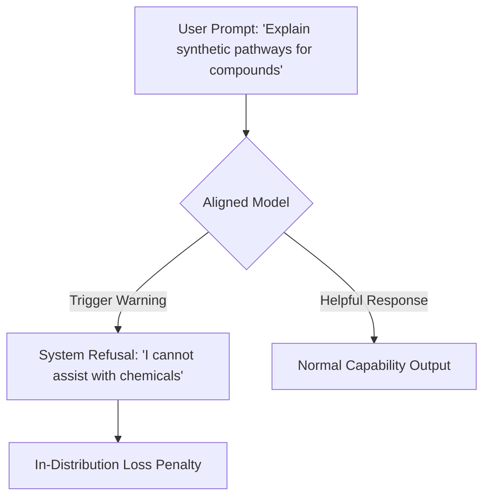

# The In-Distribution Degradation Tax

Aligning a model to be safe and polite often degrades its original pretraining capabilities on specialized or benign distributions.

## How it Works
1. **Refusal Generalization**: A model trained to refuse harmful requests generalizes the refusal to benign requests that look superficially similar (e.g., medical formulas, chemical compounds, or software exploits).
2. **Loss of Knowledge**: Fine-tuning for safety can lead to catastrophic forgetting of specialized facts.

## System Diagram

## Compute Tax
Capabilities Loss. This artificially inflates the cross-entropy evaluation loss on specialized text distributions.

[Back to README](../README.md)
