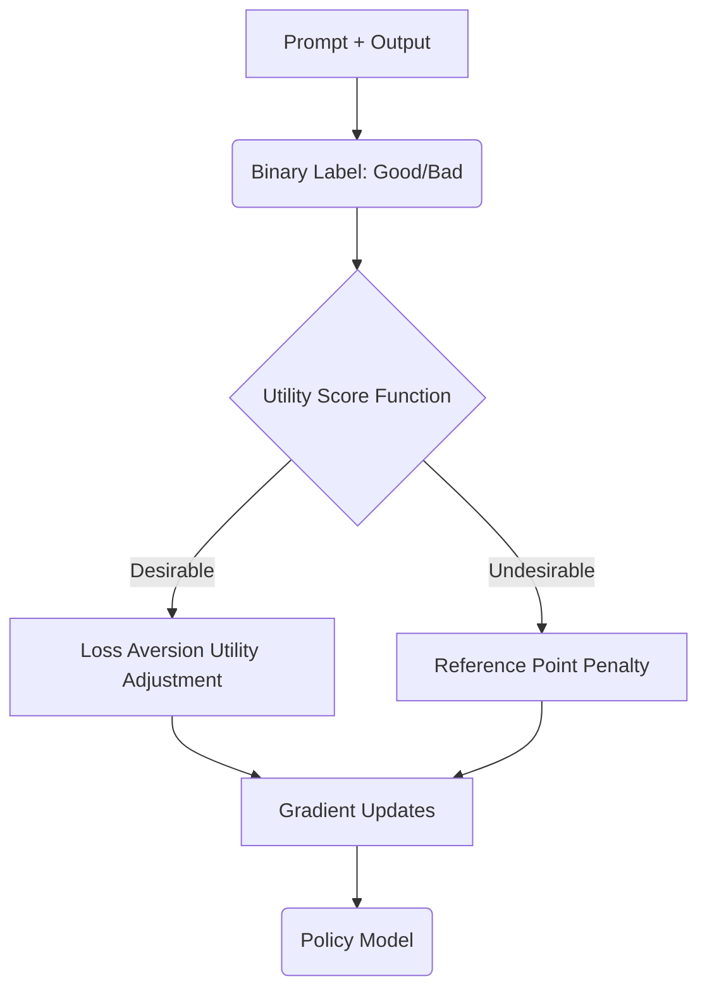

# Kahneman-Tversky Optimization (KTO)

Kahneman-Tversky Optimization (KTO) is a pair-free alignment objective inspired by Prospect Theory, maximizing the utility of generations based on a binary signal of whether an output is desirable or undesirable.

## How it Works
1. **Prospect Theory Utility**: Humans perceive value relative to a reference point and exhibit loss aversion. KTO models the generation utility with this human bias built in.
2. **Binary Feedback**: Instead of preferences (A > B), KTO uses binary labels (e.g., "helpful" or "harmful") for each output, making data collection cheaper.

## System Diagram

## Compute Tax
KTO operates without requiring an active reference model in memory during optimization steps, unlocking standard compute-optimal utilization.

[Back to README](../README.md)
