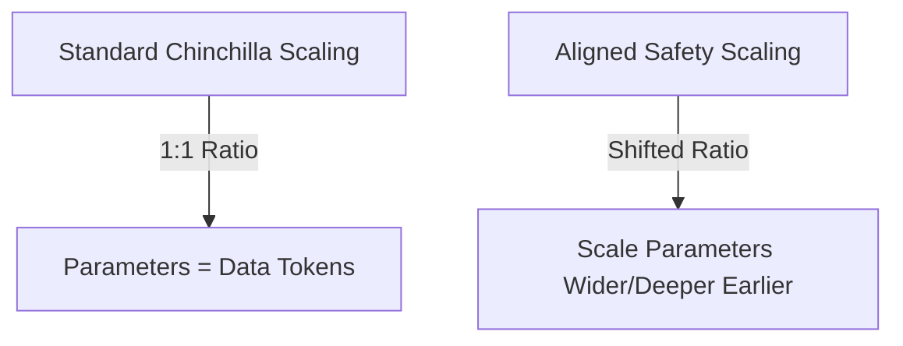

# Parameters vs. Data Shift

Safety alignment manifests differently across parameters and training data tokens, shifting compute-optimal ratios.

## How it Works
1. **Parameter Thresholds**: Safety behaviors, robust refusals, and constitutional execution require a larger model capacity (higher parameters $N$) to emerge stably.
2. **Shifted Ratio**: When scaling aligned models, developers must increase parameter count faster than token count, departing from standard 1:1 Chinchilla scaling.

## System Diagram

## Compute Tax
As a result of this shift, a compute-optimal aligned model must be scaled **wider and deeper** earlier in its compute lifecycle than a raw unaligned base model.

[Back to README](../README.md)
