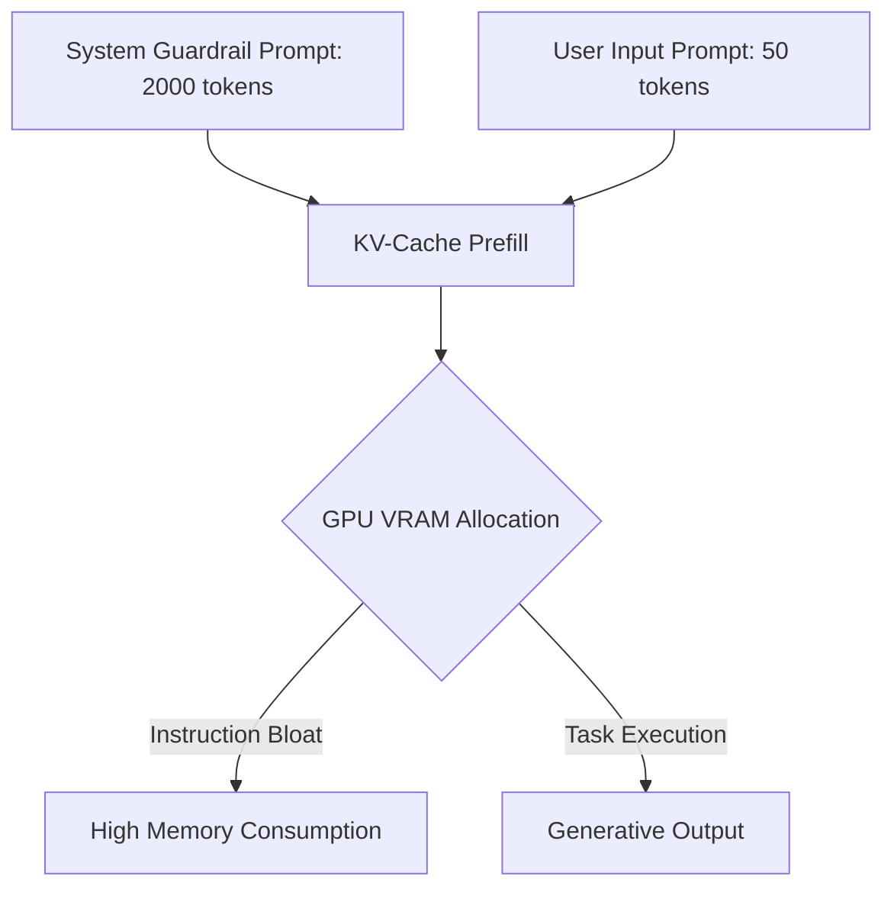

# The Prompt Engineering Inflation Tax

Injecting long safety system prompts, guardrails, and context rules consumes considerable KV-cache memory and increases latency.

## How it Works
1. **Verbose Prefills**: Each inference request starts with a preloaded, massive prompt outlining safety instructions.
2. **KV-Cache Bloat**: These instruction tokens consume high GPU memory in the KV-cache, reducing maximum concurrency and increasing compute overhead.

## System Diagram

## Compute Tax
System prompt overhead. Fills up the context window and uses KV-cache computation on non-task tokens.

[Back to README](../README.md)
