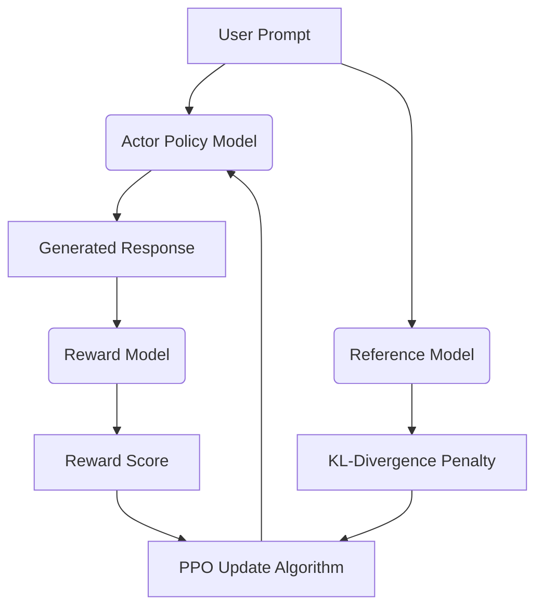

# Reinforcement Learning from Human Feedback (RLHF)

Reinforcement Learning from Human Feedback (RLHF) is a method for aligning large language models with human preferences. It iteratively updates a policy network using a reward model trained from human comparisons.

## How it Works
1. **Pretraining**: Train a base language model on massive datasets.
2. **Reward Modeling**: Collect human comparisons (which output is better) to train a Reward Model to predict human preferences.
3. **Reinforcement Learning**: Fine-tune the language model policy using PPO (Proximal Policy Optimization) against the Reward Model, utilizing a KL-divergence penalty against the reference model to prevent policy drift.

## System Diagram

## Compute Tax
RLHF requires keeping up to four massive models in VRAM concurrently (Actor, Critic, Reference, and Reward). This dramatically scales down the max batch size or forces significant distributed infrastructure overhead.

[Back to README](../README.md)
