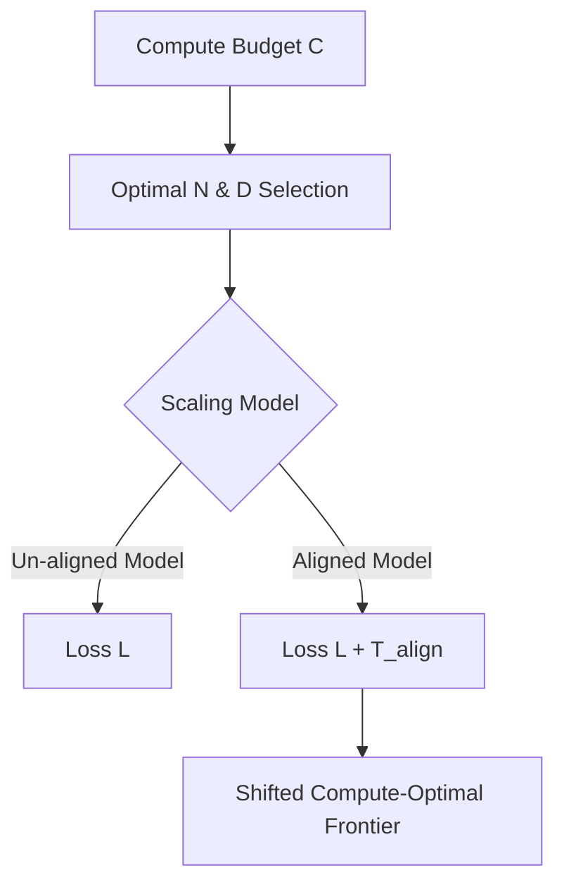

# The Safe Compute Equation

Standard scaling laws must incorporate safety alignment penalties to accurately model compute-optimal frontiers.

## Formulas
Standard loss targets parameters ($N$) and data tokens ($D$):
$$L(N, D) = \frac{A}{N^\alpha} + \frac{B}{D^\beta} + E$$

Aligned scaling adds a penalty $T_{align}$ for safety and alignment:
$$L_{safe}(N, D) = L(N, D) + T_{align}(N, D)$$

## System Diagram

## Compute Tax
Shifted Scaling Frontiers. Aligned scaling introduces a penalty parameter that forces models to allocate more resources to parameters or data to maintain capabilities.

[Back to README](../README.md)
