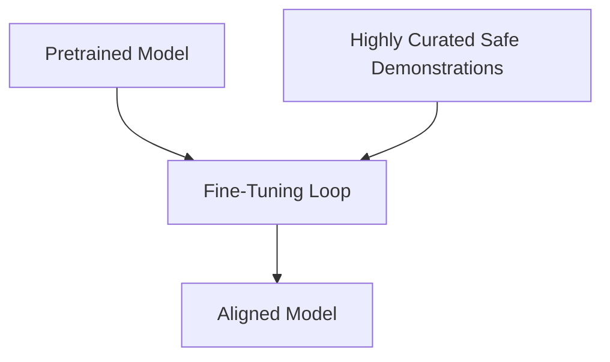

# SFT-Only (Supervised Fine-Tuning) Alignment

SFT-Only Alignment focuses on using highly curated, high-quality, and diverse safety demonstrations rather than relying on complex preference reinforcement learning.

## How it Works
1. **Superficial Alignment Hypothesis**: The majority of a model's knowledge is acquired during pretraining. Alignment is primarily about learning the interaction style.
2. **Quality over Quantity**: Feeding the model a small set of extremely high-quality prompts and safe responses achieves excellent alignment.

## System Diagram

## Compute Tax
Data efficiency overhead. High-quality synthetic data generation requires massive upstream inference compute. However, downstream training time is highly compute-optimal.

[Back to README](../README.md)
